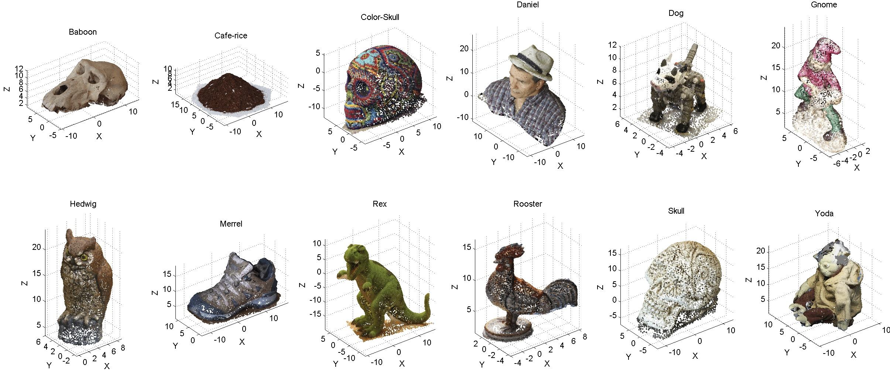

# 3DVis dataset


## About
3DVis dataset includes a set of 12 heterogeneous scenes for testing 3D scene registration and analysis methods.
Models include homogeneous shapes, repetitive photommetric patterns and symmetries.
Matlab © scripts for data handling are included. Scenes are stored in Wavefront .obj format as point clouds with vertex and normals information

## License
3DVis is primarily [MPL2](http://www.mozilla.org/MPL/2.0/) licensed
([FAQ](http://www.mozilla.org/MPL/2.0/FAQ.html)). Some files contain
third-party code under other licenses.

## Attribution
If you use 3DVis dataset in your academic projects, please cite the papers we
implement as appropriate:

```bibtex
@article{cirujeda20153d,
  title={A 3d scene registration method via covariance descriptors and an evolutionary stable strategy game theory solver},
  author={Cirujeda, Pol and Cid, Yashin Dicente and Mateo, Xavier and Binefa, Xavier},
  journal={International Journal of Computer Vision},
  volume={115},
  number={3},
  pages={306--329},
  year={2015},
  publisher={Springer}
}

@inproceedings{cirujeda2014mcov,
  title={MCOV: a covariance descriptor for fusion of texture and shape features in 3D point clouds},
  author={Cirujeda, Pol and Mateo, Xavier and Dicente, Yashin and Binefa, Xavier},
  booktitle={2014 2nd International Conference on 3D Vision},
  volume={1},
  pages={551--558},
  year={2014},
  organization={IEEE}
}
```